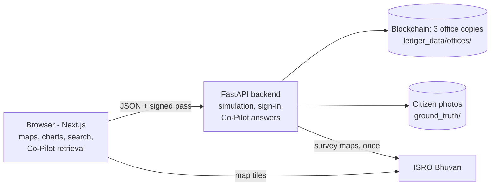

# National Digital Platform for Land Governance

**SIH26019** - National Digital Platform for Research, Policy Innovation and
Evidence-Based Land Governance.

Before farmland, forest or a wetland is converted, this platform shows what the
change would do to flood risk, displacement and farmland. It backs that up with
research and ISRO's own survey maps, and keeps a tamper-proof record of what
was decided and what citizens saw on the ground.

Shown for Pune, Nashik and Nagpur districts, with five zones inside Pune.

---

## Start it

### Windows - one click

Double-click **`start.bat`**.

The first run installs everything (a few minutes, needs internet); later runs
start in seconds. It opens two server windows and then the website at
http://localhost:3000. To stop, close the two server windows.

You need **Python 3.10+** ([python.org](https://www.python.org/downloads/))
and **Node.js 18.17+** ([nodejs.org](https://nodejs.org/)).

### Any system - by hand

```bash
# Terminal 1 - backend (API on :8000)
cd backend
python -m venv .venv
.venv/Scripts/python -m pip install -r requirements.txt      # macOS/Linux: .venv/bin/python
.venv/Scripts/python -m uvicorn main:app --port 8000
```

```bash
# Terminal 2 - website (on :3000)
cd frontend
cp .env.local.example .env.local
npm install
npm run dev
```

### Demo sign-ins

| Role | Username | Password | Can do |
|---|---|---|---|
| Researcher | `researcher@demo` | `researcher-demo` | Run simulations, read research, verify the ledger |
| Government Official | `official@demo` | `official-demo` | Everything above, plus approve / reject policies on the blockchain |
| Public User | `citizen@demo` | `citizen-demo` | View everything, send ground-truth photos, check no record was altered |

The sign-in screen lists these, so nobody has to remember them. Refreshing the
page signs you out (the sign-in pass is kept in memory only).

---

## What's inside

| Tab | What it does |
|---|---|
| **Dashboard** | The platform in five steps - read, explore, test, seal, fund - plus live counts of decisions and citizen photos on the ledger. |
| **Simulator** | Pick a district or zone, a type of change (agri → commercial, agri → residential, forest → urban, wetland encroachment) and how much. Get flood-risk increase, people displaced, farmland lost, a 0-100 risk score and the full risk curve. Officials approve or reject here, which seals the decision on the blockchain. The **AI Co-Pilot** answers questions and cites its sources. |
| **Blockchain Ledger** | Every decision and citizen photo as a signed chain of blocks, held by three offices. See each office's copy, the registered keys and the rule book; try three ways to cheat (and watch each get caught); repair a tampered office; check a printed report against the chain. |
| **Knowledge Repository** | Research papers, datasets, policy documents and case studies with typo-tolerant, relevance-ranked search. |
| **GIS Explorer** | The district map with thematic layers, live ISRO Bhuvan land-use tiles, citizen photo pins, **Report what you see**, and the **Time machine**. |
| **Innovation Hub** | Open calls and grants: officials publish, researchers apply. |

### The four ideas worth explaining

**1. A blockchain for land decisions** (`backend/blockchain.py`, `backend/signing.py`)

Six ideas, each one visible in the Ledger tab:

| Idea | What it means here |
|---|---|
| **Block** | One sealed record: the decision, the reason, the risk numbers, who made it and when. |
| **Hash** | A SHA-256 fingerprint of the block. Change one character and it changes completely. |
| **Chain** | Each block stores the previous block's hash, so editing an old block breaks the link after it. |
| **Proof of work** | A block is accepted only once its hash starts with `000` (about 4,000 tries). |
| **Digital signature** | Every record is signed with its author's Ed25519 key. The public keys live in the first block, so anyone can check who sealed what. Edit a record and the signature stops fitting. |
| **Consensus** | Three offices (central, state, district) each keep a copy. A new block is added only when most of them accept it, and when copies differ, the one most offices hold wins. |

On top sits a **rule book** that every office enforces before accepting a
block, the same idea as a smart contract: only officials may sign decisions,
and approving a High-risk policy needs a written reason.

The Ledger tab lets you play a corrupt insider who controls one office:

| Attack | Caught by |
|---|---|
| Edit a record | its fingerprint no longer matches |
| Edit it and re-mine every later block | the signature (only the official's key could re-sign), and the other offices outvote the copy |
| Erase a record and rebuild the rest | nothing on that copy - every check passes - but the other two offices still hold the record and outvote it |

**Repair from the other offices** throws the bad copy away and downloads the
agreed one, which is how a real network heals. Every decision also has a
printable report showing its fingerprint, signature and how many offices hold
it, so a printout can be checked against the chain.

**2. Citizen ground truth** (`/api/ground-truth`)
Anyone signed in can pin a photo to the map. The photo's own SHA-256
fingerprint is signed by the reporter and sealed in a block. If the stored
file is ever swapped, its listing flags `photo_intact = false`.

**3. Time machine with measured change** (`backend/landuse_change.py`)
It flips between ISRO's 2005 and 2015 land-use surveys of north-west Pune
(Hinjewadi, Pimpri-Chinchwad). The backend downloads both survey maps and
classifies every pixel against ISRO's own legend colours. The result:
built-up land grew from **61.1 km² to 96.4 km²** (+35.3 km²), measured, not
estimated. The measurement runs once in the background (about a minute) and
is cached in `backend/cache/`.

**4. A Co-Pilot that cites its evidence** (`frontend/lib/search.ts`, `/api/copilot`)
This is lightweight retrieval-augmented answering. The browser finds the
research-library passages that genuinely match the question; a weak match
is dropped rather than cited. The backend adds ISRO's measured change and
any matching decisions sealed on the ledger, then answers with numbered
citations `[1] [2]` listed under the reply.

**Sign-in and permissions** (`backend/auth.py`)
Passwords are stored as PBKDF2 hashes. Signing in returns a pass signed with
HMAC-SHA256 that lasts 8 hours. The server checks the pass on every request,
so only an official can seal a decision, even if someone edits the website.

### How the pieces talk



### Project layout

```
backend/
  main.py             API: simulation, Co-Pilot, ledger, sign-in, photos, land-use change
  blockchain.py       the chain and the network of offices: hashing, proof of work,
                      checks, rule book, majority vote, tamper demo, repair
  signing.py          Ed25519 digital signatures on every record
  auth.py             password hashing and signed sign-in passes
  tests/              automated tests for the blockchain network
  landuse_change.py   measures built-up change from ISRO's 2005 / 2015 survey maps
frontend/
  app/page.tsx        the six tabs;  app/report/page.tsx  printable decision report
  components/         views/ (one per tab), maps, Co-Pilot chat, panels
  lib/                API clients, search, districts, zones, levers, roles
  data/               Census 2011 district boundaries
start.bat             one-click start for Windows
```

### API

| Method | Path | Notes |
|---|---|---|
| GET | `/api/districts`, `/api/zones`, `/api/levers` | Reference data |
| POST | `/api/simulate` | Projection for a district or zone |
| POST | `/api/copilot` | Answer with numbered citations |
| POST | `/api/auth/login` · GET `/api/auth/me` | Sign in, check the pass |
| GET | `/api/ledger` · `/api/ledger/verify` | The agreed chain, every office's copy, fresh checks |
| POST | `/api/ledger/record` | Sign and propose a decision (officials only); returns each office's vote |
| POST | `/api/ledger/tamper` | The cheating demo: `edit`, `rewrite` or `erase` on one office |
| POST | `/api/ledger/repair` · `/api/ledger/restore` | Repair one office / every office from the majority |
| GET / POST | `/api/ground-truth` | List / send a citizen photo (sign-in needed to send) |
| GET | `/api/landuse-change` | Measured 2005 → 2015 change |

Interactive docs at http://localhost:8000/docs while the backend runs.

---

## What is real and what is a demo

Saying this up front is better than a judge finding it.

| Part | Status |
|---|---|
| District boundaries | **Real** - Census of India 2011 (via [udit-001/india-maps-data](https://github.com/udit-001/india-maps-data)) |
| Land-use tiles and the time machine | **Real** - ISRO Bhuvan WMS. The 2005 → 2015 change is measured from ISRO's own maps. |
| Blockchain: hashing, proof of work, Ed25519 signatures, majority consensus, rule book | **Real** and working, with automated tests. Simplified: the three offices run inside one server so the demo can show them side by side - in production each runs on its own office's server. Signing keys are derived by the server for the demo accounts; in production each official signs with their own Digital Signature Certificate (DSC) token. |
| Simulation numbers | **Illustrative** - simple per-district coefficients, not a trained model. The production path is a model trained on Bhuvan land-use, climate and census data. |
| Research library | **Sample entries** - titles, authors and findings are illustrative, and labelled as such in the app. |
| Thematic map layers (vulnerability, infrastructure, population) | **Illustrative** overlays for the demo. |
| Co-Pilot | Rule-based answers plus real retrieval and real citations - no large language model, so it never makes facts up. |
| Accounts | Three demo accounts with published passwords. Storage is JSON files, not a database. |
| Innovation Hub, session activity | Kept in the browser's memory for the demo. |

---

## Good to know

- **Reset the demo data:** stop the backend, delete `backend/ledger_data/` and
  `backend/ground_truth/`, and start again. Fresh copies with a 3-block ledger
  are created for all three offices. Keep `backend/cache/` - it saves
  re-measuring the land-use change.
- **Run the tests:** `cd backend`, then `.venv\Scripts\python -m unittest discover -s tests -v`
  (macOS/Linux: `.venv/bin/python`). They cover signing, the rule book, every
  attack and repair.
- **ISRO Bhuvan offline?** The GIS Explorer falls back to the built-in layers
  and says so. The time machine needs Bhuvan, and the measured change needs it
  once, the first time.
- **Windows: use normal Python, not MSYS2.** An MSYS2/mingw Python has no
  prebuilt packages, so installs fail. `start.bat` uses the `py` launcher to
  avoid it.
- **Port taken?** The backend needs 8000. If 3000 is busy, Next.js moves to
  3001 - open the address its window shows (the backend accepts any `localhost`
  port), or close the other app and start again.
- **Production build:** `cd frontend && npx next build && npx next start`.

## A five-minute demo

1. **Sign in as Researcher.** The Dashboard shows the five steps the platform follows.
2. **Simulator → Hadapsar, Agri → Commercial, "Accelerated".** The risk score and curve jump, because Hadapsar sits on the Mula-Mutha floodplain.
   Open **Ask the AI Co-Pilot** → *Why did flood risk increase?* The answer cites a research entry `[1]`.
3. **GIS Explorer → Time machine → Show on map**, then press play. Red built-up land spreads across north-west Pune, and the card shows **+35.3 km², measured from ISRO's maps**.
4. **Switch role (top right) → Government Official.** Set the same scenario (Hadapsar, Accelerated) and press **Approve** with no reason. All three offices refuse it: the rule book says a High-risk approval needs a reason. Type one and approve again. The block is signed with the official's key, mined, and accepted by 3 of 3 offices. Open **Download report**.
5. **Blockchain Ledger.**
   - All three offices agree and every block checks out.
   - **Try to cheat the ledger** on the District office:
     - *Edit a record* - the fingerprint catches it.
     - **Repair from the other offices**, then *Edit and re-mine the chain* - the hashes all fit, but the signature doesn't.
     - Repair, then *Erase a record* - every check on that copy passes, yet the other two offices outvote it 2 to 1.
   - Repair, then paste the report's fingerprint into **Check a report**. It is genuine.
6. **Switch role → Public User.** Go to GIS Explorer → **Report what you see**, pick a spot and send a photo. Its fingerprint is signed with the citizen's key and sealed in a new block.
7. **Simulator → Hadapsar → Co-Pilot:** *Has anything been decided here?* It cites the decision sealed in step 4.
